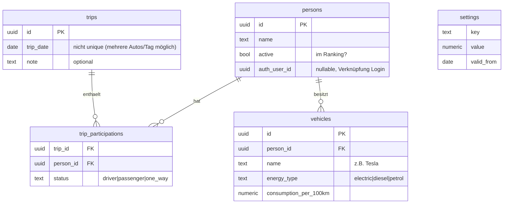

# Konzept: Fahrgemeinschafts-App

Stand: 19.07.2026 · Ersetzt die Excel-Datei `Fahrgemeinschaft.xlsx` als zentrales Verwaltungs- und Dokumentationswerkzeug.

**Name:** Arbeitstitel „Fahrgemeinschaft". Favorit für den Produktnamen: **„FairFahrt"** (fair + Fahrt, klingt wie „Vorfahrt" — trifft den Kern: faire Rotation, keine Bezahlplattform). Alternativen: „WerFährt", „Drankarte", „MitfahrLog". Entscheidung offen, technisch jederzeit änderbar (nur Anzeigename + PWA-Titel).

## 1. Ziel & Rahmen

Web-App für eine feste Fahrgemeinschaft (~9 aktive Personen, 13 historisch) zur **Dokumentation der Fahrten** und zur transparenten Antwort auf die Kernfrage: **„Wer ist als Nächstes dran?"**

- **Hauptplattform:** Web (PWA), gehostet auf **GitHub Pages** — auf dem Handy installierbar, kein App Store nötig.
- **Backend:** **Supabase** (PostgreSQL + Auth + RLS) — geteilte Daten für alle Mitglieder, Echtzeit-fähig.
- **Kein Chat:** Kommunikation bleibt in WhatsApp. Die App dokumentiert.
- **Bedienprinzip:** Der häufigste Vorgang (heutige Fahrt eintragen) muss in **unter 10 Sekunden mit 3–4 Taps** erledigt sein.

## 2. Tech-Stack (gemäß ProgrammingGuidelineDocuHub)

Der DocuHub ist vollständig Flutter-basiert; **PilzBuddy** ist die nahezu deckungsgleiche Blaupause (Flutter Web/PWA + Supabase + RLS + GitHub-Pages-Deploy).

| Baustein | Entscheidung | Quelle |
|---|---|---|
| Framework | Flutter Web (PWA), Bundle-ID `de.macbuchi.fahrgemeinschaft` | `projekt-setup-checkliste.md` |
| State | Riverpod 2 manuell (ohne Codegen) | `state-management.md` |
| Navigation | go_router mit Auth-Guard im Router (`redirect` + `refreshListenable`) | `navigation.md` |
| UI | Material 3, `ColorScheme.fromSeed`, Light+Dark via `_base(Brightness)` | `theming-design.md` |
| Design-Tokens | `AppColors._()` / `AppSpacing._()` / `AppRadius._()` ab Tag 1 (TrainingsApp-Muster, nicht PilzBuddys Schwäche wiederholen) | `theming-design.md` |
| Backend | Supabase: Auth + Postgres + **RLS** („Sicherheit gehört in die DB, nicht in den Client") | `datenhaltung.md` |
| Schema-Disziplin | `supabase/schema.sql` + nummerierte `patch_NNN_*.sql` + `applied_patches`-Tabelle + Live-Schema-Check in CI | `datenhaltung.md`, PilzBuddy |
| Tests | Fake-Backend + Flow-Tests (`buildTestApp` mit `ProviderScope.overrides`), Fakes implementieren die Repositories inkl. RLS-Nachbildung | `testing.md` |
| CI/CD | `flutter analyze` + Tests, Flutter-Version gepinnt (3.41.2), Version Guard, Auto-Tag-Release, Web-Deploy auf GitHub Pages | `build-release-ci.md` |
| Konventionen | Code Englisch, UI Deutsch; PR-Pflicht, Conventional Commits, kein Push auf main; zentraler Logger, kein `print` | `architektur.md`, `fehlerbehandlung-logging.md` |

Projektstruktur nach dem 3-Schichten-Muster: `core/` (router, theme, supabase_config, logger) · `data/` (Repositories + Provider-Registry) · `models/` · `features/<name>/`.

## 3. Fachlogik (1:1 aus dem Excel übernommen)

### 3.1 Fahrtenprotokoll
Eine **Fahrt = eine Fahrgruppe an einem Tag** (in der Regel eine pro Tag; an manchen Tagen fahren zwei getrennte Autos → dann zwei Fahrten mit demselben Datum). Jede beteiligte Person hat genau einen Status:

| Status | Bedeutung | Gewicht |
|---|---|---|
| `gefahren` | hat das Auto gestellt und gefahren | — |
| `mitgefahren` | Hin- und Rückweg mitgefahren | 1,0 |
| `1-way` | nur eine Richtung mitgefahren | 0,5 (`OneWayFaktor`) |
| (leer) | nicht dabei | 0 |

**mitgenommen** (pro Fahrt) = Σ mitgefahren + 0,5 × Σ 1-way → wird dem Fahrer gutgeschrieben.

### 3.2 Punkte & „Wer ist dran" (Fairness-Regel)

**Punktekonto (unverändert wie bisher):** Punkte je Person = Σ mitgenommen (an eigenen Fahrtagen) − eigene Mitfahrten − 0,5 × eigene 1-way-Fahrten. Pro Mitfahrer ein Punkt, zero-sum über die Gruppe. Negativ = „schuldet" Fahrten.

**Problem des reinen Punktesystems:** Punkte messen, *wie viel* jemand transportiert hat, aber nicht, *wie oft* er gefahren ist. Wer immer 4 Leute mitnimmt, baut ein Punktepolster auf und wäre an kleinen Tagen (2 Personen) rechnerisch nie dran — obwohl der Fahraufwand pro Fahrt derselbe ist. Die Excel-„Quote" (Ø Mitfahrer pro Fahrt, niedrigste = dran) korrigiert das in die falsche Richtung: Wer an kleinen Tagen einspringt, senkt seine Quote und wird dadurch noch öfter markiert.

**Vorschlag — kombinierter Fairness-Rang aus zwei Kennzahlen:**

1. **Punkte** (wie viel transportiert) — aufsteigend gerankt, wenigste Punkte = Rang 1.
2. **Fahranteil** = eigene Fahrten ÷ eigene Teilnahmetage (wie oft gefahren, relativ zur Anwesenheit) — aufsteigend gerankt, seltenster Fahrer = Rang 1.

**Dran ist, wer die niedrigste Rangsumme hat** — und zwar **unter den an diesem Tag Anwesenden** (nicht über alle Aktiven). Gleichstand: Wessen letzte Fahrt am längsten her ist, fährt. Gewichtung Punkte↔Fahranteil ist ein Parameter, damit die Gruppe nachjustieren kann.

> **Korrektur 2026-07-21 (Issue #38): Der Standard steht auf „nur Punkte" (`points_weight = 1.0`).** Die Gruppe hat entschieden, dass allein die Punkte die Reihenfolge bestimmen; der Fahranteil ist reine Anzeige. Damit gilt der oben beschriebene Ausgleich **nicht mehr im Standard** — das Beispiel darunter beschreibt seitdem die Wirkung von `points_weight = 0.5`, nicht das Verhalten der App. Die bekannte Folge: Wer selten, aber mit vollem Auto fährt, baut ein Punktepolster auf und kommt an kleinen Tagen seltener an die Reihe. Der Mechanismus bleibt im Code, nur das Gewicht ist gesetzt — zurückdrehen heißt, `points_weight` zu ändern, nicht die Formel.

*Beispiel:* A hat +12 Punkte (nimmt immer 4 mit), fuhr aber nur 10 von 100 Teilnahmetagen (10 %). B hat −3 Punkte, fuhr 20 von 80 Tagen (25 %). Kleiner Tag, nur A und B: Nach reinen Punkten wäre immer B dran. Kombiniert: Punkte-Rang B=1/A=2, Fahranteil-Rang A=1/B=2 → Gleichstand → es fährt, wer länger nicht gefahren ist. A kommt an kleinen Tagen also wieder regulär an die Reihe.

- **Quote** (Ø Mitfahrer pro Fahrt) bleibt als Anzeige-Statistik erhalten, steuert aber nicht mehr die Auswahl.
- Die App **schlägt vor, Menschen entscheiden** — der Vorschlag ist prominenter Default im Erfassungs-Flow, kein Zwang.
- **Backtest beim Import:** Die Regel wird über die 416 historischen Fahrten simuliert („wen hätte die App vorgeschlagen, wer ist wirklich gefahren?") — so kann die Gruppe die Gewichtung prüfen, bevor sie live geht.
- Das System bleibt **selbstkorrigierend bei spontanen Zu-/Absagen**: Es zählt nur, was tatsächlich gefahren wurde.

### 3.3 Statistik & Gamification
- Kilometer je Person = (gefahren + mitgefahren + 1-way) × Arbeitsweg (30 km) × 2
- Gesparte Kraftstoffkosten je Person = eigener Kostensatz/100 km × Mitfahr-Strecken (Kostensatz = Verbrauch × Energiepreis je Antriebsart)
- **Kilometerheld** = Top-2 nach Kilometern; Gesamt-Ersparnis der Gruppe (aktuell 3.761 € bei 416 Fahrten)

### 3.4 Parameter (verwaltbar in der App)
`Arbeitsweg_km = 30` · `OneWayFaktor = 0,5` · Strompreis 0,35 €/kWh · Diesel 1,70 €/l · Benzin 1,78 €/l — Preise mit **Gültig-ab-Datum** versionieren (im Excel statisch, in der App historisierbar).

## 4. Datenmodell (Supabase / PostgreSQL)

- **Alle Kennzahlen (Punkte, Quote, km, Ersparnis) werden berechnet, nie gespeichert** — als Postgres-**View** (`person_stats`), damit App und ggf. spätere Auswertungen dieselbe Wahrheit sehen.
- RLS: nur eingeloggte Gruppenmitglieder lesen/schreiben; Constraint „max. 1 `driver` pro Trip" per DB-Check.
- Personen sind von Logins entkoppelt: Fahrten können für andere eingetragen werden (einer trägt für alle ein — wie heute beim Excel).

## 5. Screens & Bedienkonzept

### 5.1 Home / Dashboard (Startscreen — alles Wichtige auf einen Blick)

- **„Wer ist dran"-Karte:** Ranking der aktiven Fahrer nach Fairness-Rang (siehe 3.2), Platz 1 & 2 prominent markiert (wie `>>>` im Excel); Punkte und Fahranteil als Detailinfo.
- **Schnellerfassungs-Button** „Fahrt eintragen" (Floating Action Button).
- Mini-Statistik: Gesamt-Ersparnis, Fahrten dieses Jahr, Kilometerheld.

### 5.2 Fahrt eintragen (der 10-Sekunden-Flow)

1. Datum vorbelegt mit **heute**, per Tap auf **gestern** umschaltbar (Nachtrag) oder frei wählbar.
2. **Teilnehmer als Kacheln antippen** (aktive Personen als große Tap-Flächen); zweiter Tap ⇒ `1-way`, dritter Tap ⇒ wieder abgewählt.
3. Die App setzt **automatisch den Fahrer**: Wer von den Ausgewählten laut Fairness-Rang dran ist, rutscht als Fahrer-Kachel **nach oben**. Passt es nicht (Werkstatt, Termin …), zieht man eine andere Kachel auf den Fahrer-Platz — der Default bleibt als Hinweis sichtbar.
4. Speichern. Fertig — Punkte aktualisieren sich sofort.

> **Korrektur 2026-07-21: Es lässt sich nichts in der Zukunft eintragen.** Der Datumswähler endet bei heute, der Schnellwahl-Chip „Morgen" ist durch „Gestern" ersetzt. Ein Eintrag im Voraus verschiebt die Punkte aller anderen für etwas, das noch nicht passiert ist — und seit v0.12.0 ist der **Wochenplaner** der Ort dafür. Damit gilt der folgende Absatz zur Vortags-Planung nicht mehr; er beschreibt den Stand vor dem Planer.

**Vortags-Planung = derselbe Eintrag:** Am Vorabend trägt man ein, wer morgen mitfahren möchte — die Fahrt für morgen entsteht mit automatisch gesetztem Fahrer (das ist zugleich die Antwort für den WhatsApp-Chat: „App sagt: X fährt"). Sagt jemand spontan ab oder zu, wird nur die Kachel an-/abgewählt und der Fahrer-Vorschlag passt sich live an. Es gibt keinen separaten Planungs-Status: Der Eintrag bleibt einfach editierbar, gezählt wird, was am Ende drinsteht.

Ein zweiter Eintrag am selben Tag ist erlaubt (zweites Auto), löst aber eine Rückfrage aus, damit versehentliche Doppel-Einträge auffallen.

### 5.3 Historie
Liste aller Fahrten (neueste zuerst, gruppiert nach KW), Suche/Filter nach Person, Bearbeiten & Löschen einzelner Fahrten.

### 5.4 Statistik
Pro Person: gefahren / mitgefahren / 1-way / mitgenommen / Quote / Punkte / km / gesparte Kosten. Gesamtwerte, Kilometerheld-Badge, einfache Verlaufs-Charts (Punkte über Zeit).

### 5.5 Verwaltung
- Personen: anlegen, **aktiv/inaktiv** schalten (inaktiv = raus aus dem Ranking, Historie bleibt — Felix, Stefan H, Noah).
- Fahrzeuge: Antriebsart + Verbrauch.
- Parameter: Arbeitsweg, 1-way-Faktor, Energiepreise (mit Gültig-ab).

## 6. Excel-Import

Einmaliges Dart-CLI-Skript (`tool/import_xlsx.dart`): liest die 416 Fahrten + 13 Personen + Fahrzeugdaten aus `Fahrgemeinschaft.xlsx` und schreibt sie nach Supabase. Danach Abgleich: berechnete Punkte/Quoten der App müssen exakt den Excel-Werten entsprechen (z. B. Marcus −5,5, Thorsten −2) — das ist zugleich der Abnahmetest für die Berechnungslogik. Bekannter Datenfehler (Ausreißer-Datum 19.11.2027) wird beim Import bereinigt/nachgefragt.

## 7. Auth & Mandanten: mehrere Gruppen, ein Login je Gruppe

- **Multi-Tenant:** Mehrere Fahrgemeinschaften teilen sich eine Instanz. **Eine Gruppe = ein Supabase-Login** (gemeinsames Passwort, in der jeweiligen Gruppe geteilt). Kein Account pro Person.
- **Login = Gruppenname + Passwort.** Technisch mappt die App den Handle auf eine interne, nie sichtbare E-Mail (`handle@grp.local`, siehe `core/group_login.dart`) — Supabase braucht formal eine E-Mail, sie muss aber weder echt noch persönlich sein.
- **Registrierung mit Freigabe:** Über „Gruppe anfragen" legt jemand Name/Handle + Passwort an; der Login entsteht sofort, die Gruppe aber als **`pending`**. Bis eine **Admin-Gruppe** sie auf `active` schaltet, sieht der Zugang nur „Warte auf Freigabe" und keine Daten. Die Freigabe ist zugleich der Spam-Schutz (öffentlich anfragbar, aber nichts ohne Freigabe).
- **Strikte Trennung (RLS):** Jede Zeile trägt `group_id = auth.uid()`; man sieht nur die eigene Gruppe und nur wenn `active`. Fremde Gruppen sind unsichtbar — serverseitig erzwungen, nicht nur in der UI.
- **Admin-Screen in der App:** Admin-Gruppen sehen offene Anfragen und geben frei/lehnen ab.
- Personen sind reine Datensätze innerhalb einer Gruppe — jeder in der Gruppe kann für jeden eintragen (wie beim Excel).
- **Offen / nächster Ausbauschritt:** Bei öffentlicher Nutzung zusätzlicher Missbrauchsschutz (Bot-Schutz/Turnstile am Signup, Rate-Limits).

## 8. Phasenplan

**Phase 0 — Setup (½ Tag):** `flutter create` mit Bundle-ID, `CLAUDE.md` mit Leitplanken, Design-Tokens, Logger, Router-Skelett, Supabase-Projekt + `schema.sql` + RLS, CI (analyze/test/Version Guard), Test-Harness (`buildTestApp` + Fakes).

**Phase 1 — MVP:** Datenmodell + Repositories, Login, Schnellerfassung, „Wer ist dran"-Dashboard, Historie mit Edit, Excel-Import + Punkte-Abgleich, GitHub-Pages-Deploy. → **Ab hier ersetzt die App das Excel.**

**Phase 2 — Statistik & Komfort:** Statistik-Screen mit Charts, Kilometerheld, Verwaltung (Personen/Fahrzeuge/Parameter), PWA-Feinschliff (Icon, installierbar, Offline-Anzeige des letzten Stands), **WhatsApp-Share-Button**: kopiert den aktuellen Stand als Text („Dran: Marcus (−5,5) → Thorsten (−2) …") bzw. öffnet das Share-Sheet — die Brücke in den Chat ohne Plugin.

Ein Planungs-/Zu-Absage-Modul ist bewusst gestrichen: Ohne WhatsApp-Integration würde es nur eine zweite Eingabestelle schaffen. Dokumentiert wird das Ist; die Tagesabstimmung bleibt im Chat.

## 9. Entschiedene Punkte & offene Fragen

Entschieden (19.07.2026):

- Name: Arbeitstitel „Fahrgemeinschaft", kreativer Name willkommen (Favorit: „FairFahrt") — keine Bezahlplattform, reine Gruppen-Organisation.
- Nächster-Fahrer-Regel: kombinierter Fairness-Rang (Punkte + Fahranteil, unter den Anwesenden), siehe 3.2. Gewichtung als Parameter, Backtest gegen die Excel-Historie.
- Kein Planungs-/Zu-Absage-Modul (WhatsApp bleibt der Kanal); stattdessen Share-Button.
- Auth: ein Gruppenlogin für alle.

Offen:

1. Finaler App-Name (entscheidet die Gruppe — „FairFahrt"?).
2. Gewichtung Punkte↔Fahranteil (Standard 50/50, nach Backtest ggf. anpassen).
