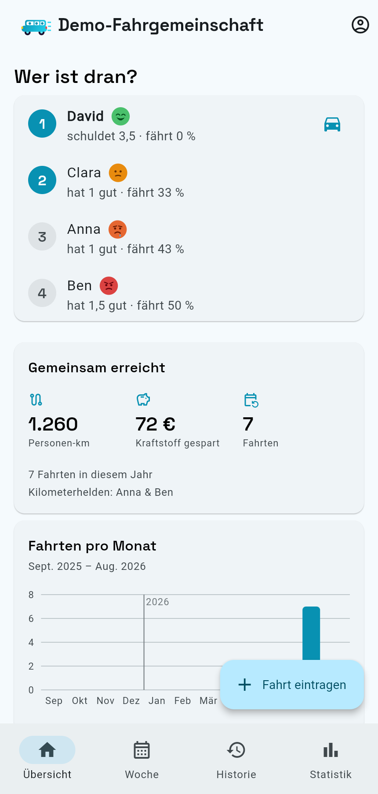
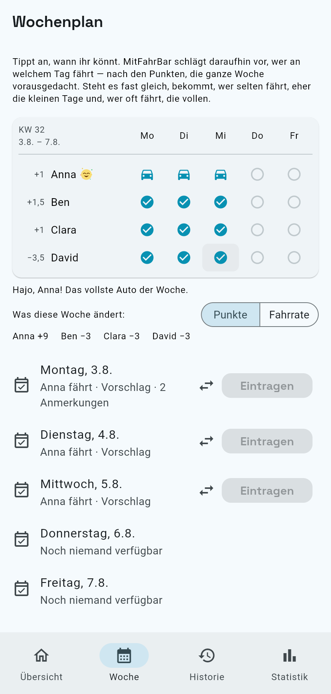
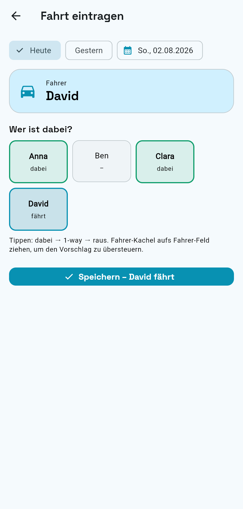
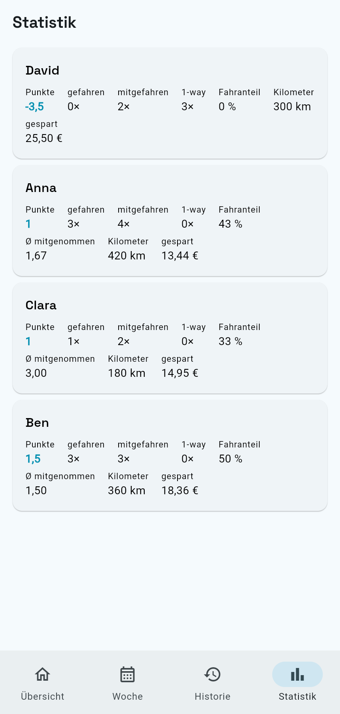

# MitFahrBar

Die faire App für eure Fahrgemeinschaft: Fahrten dokumentieren, Punkte zählen
und auf einen Blick sehen, **wer als Nächstes fahren sollte**. Mehrere Gruppen
können die App unabhängig voneinander nutzen.

**➡️ App öffnen: <https://macbuchi.github.io/MitFahrBar/>**

Auf dem Handy lässt sie sich über „Zum Home-Bildschirm hinzufügen" wie eine
normale App installieren (PWA).

| | |
| --- | --- |
|  |  |
| **Übersicht** – wer als Nächstes fahren sollte, dazu Kilometer, gesparte Kosten und Fahrten pro Monat. | **Woche** – antippen, wer wann kann; die App schlägt die Fahrer für die ganze Woche vor. |
|  |  |
| **Fahrt eintragen** – Kacheln antippen, Fahrer steht automatisch, speichern. | **Statistik** – Punkte, Fahranteil, Kilometer und gesparte Kraftstoffkosten je Person. |

<sub>Screenshots aus dem Demo-Modus der App – Anna, Ben, Clara und David sind
Beispieldaten.</sub>

## Was die App macht

- **Fahrten dokumentieren** – pro Fahrtag: wer ist gefahren, wer mitgefahren,
  wer nur eine Strecke (1-way). Mehrere Autos am selben Tag sind möglich.
- **Punkte & Fairness** – die App rechnet aus, wer wie viel getragen hat, und
  schlägt den nächsten Fahrer vor.
- **Statistik** – gefahrene Kilometer, gesparte Kraftstoffkosten,
  „Kilometerheld".
- **Dokumentation, kein Chat** – die Absprache bleibt in WhatsApp, die App
  hält fest, was tatsächlich gefahren wurde.
- **Spritpreise** *(in Arbeit)* – die App merkt sich je Woche einen Preis für
  Diesel, E5 und E10 aus dem eigenen Umkreis. Sie zeigt ihn nur; die
  Ersparnis-Rechnung nutzt weiter die selbst gepflegten Werte.

## Bedienung

### Anmelden

Anmeldung mit **Gruppenname + gemeinsamem Passwort**. Der Zugang gilt für die
ganze Gruppe – jeder kann für jeden eintragen.

### Fahrt eintragen (der 10-Sekunden-Weg)

1. Auf **„Fahrt eintragen"** tippen. Datum steht auf *heute*, **gestern** ist
   ein Tap entfernt (zum Nachtragen). In der Zukunft wird nichts eingetragen —
   dafür gibt es den Wochenplan.
2. **Teilnehmer-Kacheln antippen**: 1× = dabei, 2× = nur eine Strecke
   (1-way), 3× = wieder abgewählt.
3. Die App setzt **automatisch den Fahrer** (wer laut Fairness-Rang dran ist)
   und zeigt ihn oben. Passt es nicht, eine andere Kachel auf das Fahrer-Feld
   ziehen.
4. Speichern – die Punkte aktualisieren sich sofort.

### Wer ist dran?

Die Startseite sortiert die aktiven Fahrer allein nach den **Punkten**:

- **Punkte** = mitgenommene Personen − eigene Mitfahrten − 0,5 × eigene
  1-way-Fahrten. Wenig Punkte = viel „Schuld", also als Nächstes dran.
- Bei Gleichstand fährt, wessen letzte Fahrt am längsten her ist.

Der **Fahranteil** (eigene Fahrten ÷ eigene Teilnahmetage) bleibt als Kennzahl
sichtbar, entscheidet aber nicht mehr mit – so hatte es die Gruppe gewünscht.
Nur im Wochenplan gibt er bei praktisch gleichem Punktestand den Ausschlag,
wer die kleinen und wer die vollen Tage bekommt. Die App **schlägt vor –
entschieden wird von Menschen**.

### Woche planen

Im Reiter **Woche** tippt ihr an, wer an welchem Tag mitkann (1× = dabei,
2× = nur eine Strecke). MitFahrBar schlägt daraufhin für jeden Tag einen Fahrer
vor und denkt dabei die ganze Woche voraus; reichen die Plätze eines Autos
nicht, werden es mehrere. **„Eintragen"** öffnet den Fahrten-Editor fertig
vorbelegt – für die Punkte zählt erst das Speichern.

### Passwort

Das gemeinsame Gruppenpasswort setzt nur das **Verwalter-Konto** neu
(Anmelde-Bildschirm → „Verwalter-Konsole"). Absicht: So sperrt niemand
versehentlich die ganze Gruppe aus.

Vergisst die Verwalterin ihr eigenes Passwort, hilft dort „Passwort
vergessen?": MitFahrBar schickt einen **sechsstelligen Code** an ihre
E-Mail-Adresse, den sie in derselben Maske einträgt und dabei gleich ein
neues Passwort wählt. Bewusst ein Code und kein Link — der Code funktioniert
auch, wenn die Mail auf einem anderen Gerät geöffnet wird als dem, auf dem
angefordert wurde. Der Code gilt eine Stunde.

## Eigene Gruppe anlegen

1. Auf dem Anmelde-Bildschirm **„Verwalter-Konsole"** wählen und dort ein
   eigenes Konto **registrieren** — mit echter E-Mail-Adresse, die einmal per
   Code bestätigt wird. Dieses Konto gehört einer Person, nicht der Gruppe.
2. In der Konsole **„Neue Gruppe anlegen"**: Gruppenname, kurzer Anmeldename
   und ein gemeinsames Gruppenpasswort (zweimal eingetippt — ein Tippfehler
   wäre später nicht mehr zu heilen).
3. Die Gruppe ist **sofort nutzbar**. Anmeldename und Gruppenpasswort gebt ihr
   allen Mitgliedern; sie melden sich damit auf dem normalen Anmelde-Bildschirm
   an – vollständig getrennt von anderen Gruppen.

Ein Verwalter-Konto kann bis zu **fünf** Gruppen betreuen. Es sieht dabei
niemals Fahrten oder Personen einer Gruppe, sondern setzt nur das
Gruppenpasswort neu, gibt eine Gruppe ab oder löscht sie.

## Entwicklung

Flutter (Web-PWA und Android) mit Riverpod, go_router und Material 3; Backend ist Supabase
(PostgreSQL + Auth, Zugriffsschutz über Row Level Security). Details zu
Konzept und Fachlogik: [KONZEPT.md](KONZEPT.md), Arbeitsregeln:
[CLAUDE.md](CLAUDE.md), Änderungen: [CHANGELOG.md](CHANGELOG.md).

```bash
flutter pub get
flutter run -d chrome     # ohne Supabase-Konfiguration: Demo-Modus
flutter analyze && flutter test
```

Zum schnellen Ansehen im Browser gibt es fertige Startskripte. Sie bauen die
App als Release, liefern sie lokal aus und öffnen den Standardbrowser; Strg-C
beendet beides wieder:

```bash
./tool/run_web.sh          # macOS und Linux, Port 8080
./tool/run_web.sh 9000     # anderer Port
```

```powershell
.\tool\run_web.ps1         # Windows
.\tool\run_web.ps1 -Port 9000
```

Ohne hinterlegtes Supabase-Projekt (`lib/core/supabase_config.dart`) startet
die App in einem **Demo-Modus** mit Beispieldaten – praktisch zum Ausprobieren
ohne Backend. Beide Werte lassen sich per `--dart-define=SUPABASE_URL=…` und
`--dart-define=SUPABASE_KEY=…` zur Build-Zeit übersteuern, ohne die Datei
anzufassen.

**Testbackend:** E2E-Tests laufen gegen einen echten lokalen Supabase-Stack
(echte RLS, echte Auth-Mails via Mailpit) — ein Befehl: `tool/e2e.sh`.
Details, CI-Anbindung und die dauerhafte Test-VM: [doc/testbackend.md](doc/testbackend.md).

Die Screenshots oben erzeugt `./tool/screenshots.sh` aus dem Demo-Build (baut,
liefert lokal aus, fährt die App mit Playwright durch). Sie sind Erzeugnisse —
nicht von Hand bearbeiten; bei Änderungen an der Oberfläche zieht der Workflow
„Screenshots" sie im PR selbst nach.

Marke und Gestaltung folgen dem Design-Set „MitFahrBar": Tokens in
[lib/core/tokens.dart](lib/core/tokens.dart), die Bildmarke als Widget in
[lib/core/widgets/mitfahrbar_mark.dart](lib/core/widgets/mitfahrbar_mark.dart).
App-Icons entstehen aus der Marke mit `tool/brand/build_icons.sh`.

Datenbank-Schema und Migrationen liegen unter [supabase/](supabase/) und
werden bei Push auf `main` automatisch eingespielt. Ein Release entsteht durch
Erhöhen von `version:` in `pubspec.yaml`.

## Lizenz und Datenquellen

Der Code steht unter der [MIT-Lizenz](LICENSE). Nicht daran hängen die
gebündelten Schriften und die verwendeten Fremddaten — beide bringen eigene
Bedingungen mit, und die verlangen eine Nennung:

- **Schriften:** Space Grotesk und Manrope stehen unter der SIL Open Font
  License; ihr Lizenztext wird mitgeliefert.
- **Spritpreise:** [Tankerkönig-Spritpreis-API](https://creativecommons.tankerkoenig.de/),
  lizenziert unter [CC BY 4.0](https://creativecommons.org/licenses/by/4.0/) —
  Daten der Markttransparenzstelle für Kraftstoffe (MTS-K).
- **Ortssuche:** [OpenStreetMap](https://www.openstreetmap.org/copyright)
  (© OpenStreetMap-Mitwirkende, ODbL) über Nominatim.

Fahrten, Punkte und Statistik entstehen ausschließlich aus den Einträgen der
Gruppe. Dieselbe Nennung steht in der App unter „Über MitFahrBar" — die
Lizenzen verlangen sie dort, wo die Daten benutzt werden, nicht nur im Repo.

